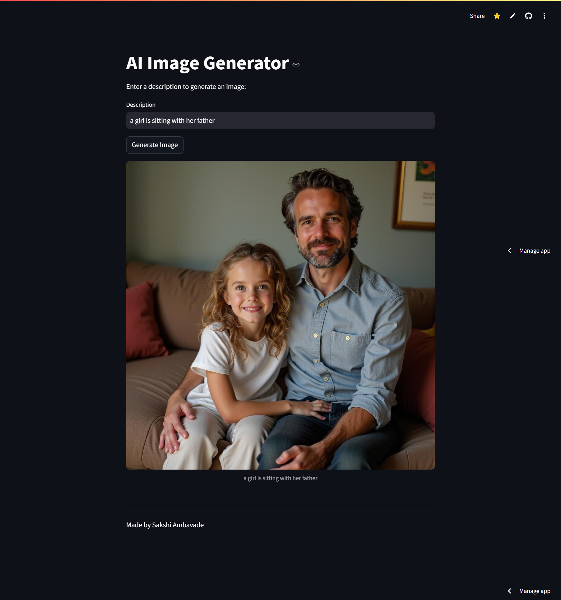

# 🖼️ AI Text-to-Image Generator 🎨  

This is a **Text-to-Image AI Generator** built with **Streamlit** and **Hugging Face's Inference API**. Enter a description, and the AI will generate an image based on the given text.  

  

---

## 🚀 Features  
✅ Generates AI-powered images from text prompts  
✅ Uses **Hugging Face API** for image generation  
✅ Simple **Streamlit UI** for easy input and visualization  
✅ Secure API key management with **`.env` file**  
✅ **Docker support** for containerized deployment  
